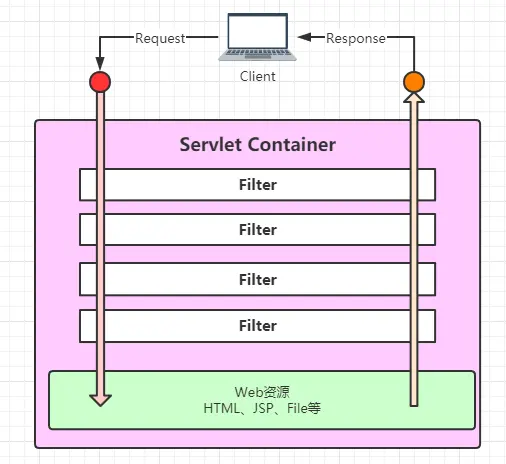
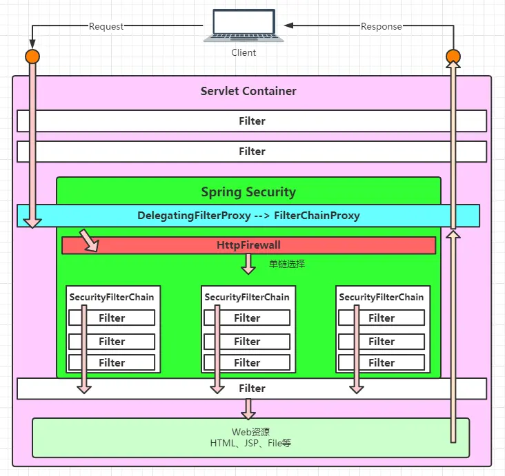

# Spring Security原理分析【1】——整体布局切入

Spring Security 是Spring家族中基于JavaEE的企业Web应用程序的安全服务框架。准确而言是基于JavaEE中Servlet规范的Filter机制。

根据Servlet规范：一个客户端请求Request在Servlet容器中需要经过Filter Chain中一些列Filter处理后才会获取到Web资源，而且响应Response也需要再次经过Filter Chain中的Filter处理后才能返回给客户端。Spring基于该Servlet规范，在Filter中接入安全机制来保证Web资源的安全。



在Spring中，Filter对应的Bean为GenericFilterBean。它是一个抽象类，具体类为DelegatingFilterProxy，该类是一个委托类。

```java
public class DelegatingFilterProxy extends GenericFilterBean {
    ...
    // Web上下文
    @Nullable
    private WebApplicationContext webApplicationContext;

     // 委托目标类名称
    @Nullable
    private String targetBeanName;
    // 是否管理Filter的生命周期
    private boolean targetFilterLifecycle = false;

     // 委托目标类实例（Filter)
    @Nullable
    private volatile Filter delegate;
    ...
}
```

核心方法doFilter简化后如下：

```java
@Override
public void doFilter(ServletRequest request, ServletResponse response, FilterChain filterChain)
        throws ServletException, IOException {
    // delegate支持懒加载
    Filter delegateToUse = this.delegate;
    // invokeDelegate 调用委托目标的doFilter
    delegate.doFilter(request, response, filterChain);
}
```

正常情况下Servlet的Filter需要配置在web.xml中，这样Servlet容器初始化时就能找到并管理其生命周期，DelegatingFilterProxy则是Spring中用来找到那些不注册在web.xml中的Filter，然后交给Servlet去处理。

DelegatingFilterProxy是通过WebApplicationContext从IOC中根据targetBeanName获取已注册的Filter Bean。Spring Security基于Spring，因此也是利用该机制来完成Filter的注册的，其targetBeanName="springSecurityFilterChain"。

在基于web.xml类型的Web应用中，需要配置：

```xml
<filter>
  <filter-name>springSecurityFilterChain</filter-name>
  <filter-class>org.springframework.web.filter.DelegatingFilterProxy</filter-class>
</filter>
<filter-mapping>
  <filter-name>springSecurityFilterChain</filter-name>
  <url-pattern>/*</url-pattern>
</filter-mapping>
```

基于JavaConfig类型的Web应用中，则需要配置：

```java
@Bean
public FilterRegistrationBean springSecurityFilterChain(ServletContext servletContext) {
    DelegatingFilterProxy springSecurityFilterChain = new DelegatingFilterProxy("springSecurityFilterChain");
    return new FilterRegistrationBean(springSecurityFilterChain);
}
```

springSecurityFilterChain这只是BeanName，其具体类为：FilterChainProxy，其doFilter如下：

```java
@Override
public void doFilter(ServletRequest request, ServletResponse response, FilterChain chain)
        throws IOException, ServletException {
    boolean clearContext = request.getAttribute(FILTER_APPLIED) == null;
    if (clearContext) {
        try {
            // 已执行标识
            request.setAttribute(FILTER_APPLIED, Boolean.TRUE);
            // 抽象方法
            doFilterInternal(request, response, chain);
        } finally {
            SecurityContextHolder.clearContext();
            request.removeAttribute(FILTER_APPLIED);
        }
    } else {
        doFilterInternal(request, response, chain);
    }
}
```

前面也说了一个客户端请求需要经过2次Filter，而整个请求是单条链，因此正常情况下只需要一次就可以了。Filter的核心为doFilter，在FilterChainProxy中抽象为doFilterInternal进行了隔离分层

```java
private void doFilterInternal(ServletRequest request, ServletResponse response, FilterChain chain) 
        throws IOException, ServletException {
    // 请求防火墙
    FirewalledRequest fwRequest = firewall.getFirewalledRequest((HttpServletRequest) request);
    // 响应
    HttpServletResponse fwResponse = firewall.getFirewalledResponse((HttpServletResponse) response);
    // 获取过滤器列表
    List<Filter> filters = getFilters(fwRequest);
    // 如果未获取到，则说明没有额外的过滤器注册，正常走Servlet的Filter流程
    if (filters == null || filters.size() == 0) {
        fwRequest.reset();
        chain.doFilter(fwRequest, fwResponse);
        return;
    }
    // 如果获取到，则走Spring Security的过滤器执行流程，构建了VirtualFilterChain
    VirtualFilterChain vfc = new VirtualFilterChain(fwRequest, chain, filters);
    // 虚拟的过滤器链执行
    vfc.doFilter(fwRequest, fwResponse);
}
```

这里的getFilters很重要，决定了Spring Security到底执行了什么过滤器

```java
/**
* Returns the first filter chain matching the supplied URL.
*
* @param request the request to match
* @return an ordered array of Filters defining the filter chain
*/
private List<Filter> getFilters(HttpServletRequest request) {
    // 对SecurityFilterChain逐个匹配HttpServletRequest
    for (SecurityFilterChain chain : filterChains) {
        if (chain.matches(request)) {
            // 每条链是多个Filter，但是最终只返回首个匹配的链
            return chain.getFilters();
        }
    }
    return null;
}
```

SecurityFilterChain 是配置到FilterChainProxy中的，配置过程很复杂，这里先不说，最终配置好的SecurityFilterChain为一个集合：filterChains。而SecurityFilterChain#matches则决定了请求流程，这是一个单向开关，多个过滤器链最终只能执行一条。单条过滤器链抽象为VirtualFilterChain，该类是一个经典的变形责任链模式。
其实到这里，一个正常的Servlet容器已经将Spring Security容纳进去了：



## `SecurityFilterChain`过滤器注入流程

第一步：整个过程在`WebSecurityConfiguration`配置类中，首先通过`setFilterChainProxySecurityConfigurer()`方法通过`@Autowired`自动注入容器中定义的`ObjectPostProcessor`和`webSecurityConfigurers`对象，然后通过`objectPostProcessor`定义了一个`WebSecurity`对象，并通过抽象类的AbstractConfiguredSecurityBuilder中的`apply()`方法初始化了一个`LinkedHashMap`定义为`configurers`变量。

```java
@Configuration(proxyBeanMethods = false)
public class WebSecurityConfiguration implements ImportAware, BeanClassLoaderAware {

    private WebSecurity webSecurity;

    @Autowired(required = false)
    public void setFilterChainProxySecurityConfigurer(
            ObjectPostProcessor<Object> objectPostProcessor,
            @Value("#{@autowiredWebSecurityConfigurersIgnoreParents.getWebSecurityConfigurers()}") List<SecurityConfigurer<Filter, WebSecurity>> webSecurityConfigurers)
            throws Exception {
        //初始化WebSecurity
        webSecurity = objectPostProcessor
                .postProcess(new WebSecurity(objectPostProcessor));
        if (debugEnabled != null) {
            webSecurity.debug(debugEnabled);
        }
        for (SecurityConfigurer<Filter, WebSecurity> webSecurityConfigurer : webSecurityConfigurers) {
            //初始化抽象类AbstractConfiguredSecurityBuilder中configurers参数
            webSecurity.apply(webSecurityConfigurer);
        }                        
    }
}
//apply()方法在WebSecurity类的抽象类AbstractConfiguredSecurityBuilder中
public abstract class AbstractConfiguredSecurityBuilder<O, B extends SecurityBuilder<O>>
        extends AbstractSecurityBuilder<O> {
    //定义了一个LinkedHashMap用于存webSecurityConfigurer
    private final LinkedHashMap<Class<? extends SecurityConfigurer<O, B>>, List<SecurityConfigurer<O, B>>> configurers = new LinkedHashMap<>();

    public <C extends SecurityConfigurer<O, B>> C apply(C configurer) throws Exception {
        add(configurer);
        return configurer;
    }
    private <C extends SecurityConfigurer<O, B>> void add(C configurer) {
        Assert.notNull(configurer, "configurer cannot be null");

        Class<? extends SecurityConfigurer<O, B>> clazz = (Class<? extends SecurityConfigurer<O, B>>) configurer
                .getClass();
        synchronized (configurers) {
            if (buildState.isConfigured()) {
                throw new IllegalStateException("Cannot apply " + configurer
                        + " to already built object");
            }
            List<SecurityConfigurer<O, B>> configs = allowConfigurersOfSameType ? this.configurers
                    .get(clazz) : null;
            if (configs == null) {
                configs = new ArrayList<>(1);
            }
            configs.add(configurer);
            //添加到LinkedHashMap中
            this.configurers.put(clazz, configs);
            if (buildState.isInitializing()) {
                this.configurersAddedInInitializing.add(configurer);
            }
        }
    }    
}

```

第二步：回到`WebSecurityConfiguration`配置类，通过`@Bean`注入`springSecurityFilterChain`对象，此对象通过第一步初始化的`webSecurity`对象中的`build()`方法进行构建。通过`init()`方法更加第一步初始化`configurers`对象进行初始化执行抽象类`WebSecurityConfigurerAdapter`中的`init()`，并将自身`webSecurity`对象作为参数传入，并执行`securityFilterChainBuilders()`方法初始化`HttpSecurity`对象，`HttpSecurity`对象通过`getHttp()`方法构建此处不展开。以及通过`HttpSecurity`对象初始化拦截器`securityInterceptor`注入到`webSecurity`对象中。

```java
@Configuration(proxyBeanMethods = false)
public class WebSecurityConfiguration implements ImportAware, BeanClassLoaderAware {

    @Bean(name = AbstractSecurityWebApplicationInitializer.DEFAULT_FILTER_NAME)
    public Filter springSecurityFilterChain() throws Exception {
        boolean hasConfigurers = webSecurityConfigurers != null
                && !webSecurityConfigurers.isEmpty();
        if (!hasConfigurers) {
            WebSecurityConfigurerAdapter adapter = objectObjectPostProcessor
                    .postProcess(new WebSecurityConfigurerAdapter() {
                    });
            webSecurity.apply(adapter);
        }
        //WebSecurity类进行构建方法
        return webSecurity.build();
    }

}
//build()方法在WebSecurity类的抽象类AbstractConfiguredSecurityBuilder中
public abstract class AbstractConfiguredSecurityBuilder<O, B extends SecurityBuilder<O>>
        extends AbstractSecurityBuilder<O> {
    private final LinkedHashMap<Class<? extends SecurityConfigurer<O, B>>, List<SecurityConfigurer<O, B>>> configurers = new LinkedHashMap<>();
    //构建方法
    public final O build() throws Exception {
        if (this.building.compareAndSet(false, true)) {
            this.object = doBuild();
            return this.object;
        }
        throw new AlreadyBuiltException("This object has already been built");
    }     
    @Override
    protected final O doBuild() throws Exception {
        synchronized (configurers) {
            buildState = BuildState.INITIALIZING;

            beforeInit();
            //准备
            init();

            buildState = BuildState.CONFIGURING;

            beforeConfigure();
            configure();

            buildState = BuildState.BUILDING;
            //构建
            O result = performBuild();

            buildState = BuildState.BUILT;

            return result;
        }
    }
    private void init() throws Exception {
        Collection<SecurityConfigurer<O, B>> configurers = getConfigurers();

        for (SecurityConfigurer<O, B> configurer : configurers) {
            //WebSecurityConfigurerAdapter子类初始化
            configurer.init((B) this);
        }

        for (SecurityConfigurer<O, B> configurer : configurersAddedInInitializing) {
            configurer.init((B) this);
        }
    }
    private Collection<SecurityConfigurer<O, B>> getConfigurers() {
        List<SecurityConfigurer<O, B>> result = new ArrayList<>();
        for (List<SecurityConfigurer<O, B>> configs : this.configurers.values()) {
            result.addAll(configs);
        }
        return result;
    }                  
}

@Order(100)
public abstract class WebSecurityConfigurerAdapter implements
        WebSecurityConfigurer<WebSecurity> {
    public void init(final WebSecurity web) throws Exception {
        final HttpSecurity http = getHttp();
        //加入到过滤器链
        web.addSecurityFilterChainBuilder(http).postBuildAction(() -> {
            FilterSecurityInterceptor securityInterceptor = http
                    .getSharedObject(FilterSecurityInterceptor.class);
            web.securityInterceptor(securityInterceptor);
        });
    }
}

```

第三步：执行完上一步的`init()`方法后继续执行`performBuild()`方法，其中`securityFilterChainBuilders`对象为上一步进行赋值，实际为一个`HttpSecurity`类，执行其抽象类`AbstractConfiguredSecurityBuilder`中的`build();doBuild();performBuild()`生成`DefaultSecurityFilterChain`对象。`HttpSecurity`类中的`requestMatcher`变量为上一步`getHttp()`方法中完成初始化。`filters`在`getHttp()`方法中仅初始化了一个过滤器`WebAsyncManagerIntegrationFilter`，其余过滤器通过抽象类`AbstractConfiguredSecurityBuilder`中的`doBuild();configure()`构建，此处不展开。`DefaultSecurityFilterChain`对象构建完成后加入`securityFilterChains`集合。

```java

public final class WebSecurity extends
        AbstractConfiguredSecurityBuilder<Filter, WebSecurity> implements
        SecurityBuilder<Filter>, ApplicationContextAware {
    public WebSecurity addSecurityFilterChainBuilder(
            SecurityBuilder<? extends SecurityFilterChain> securityFilterChainBuilder) {
        this.securityFilterChainBuilders.add(securityFilterChainBuilder);
        return this;
    }
    @Override
    protected Filter performBuild() throws Exception {
        List<SecurityFilterChain> securityFilterChains = new ArrayList<>(
                chainSize);
        for (SecurityBuilder<? extends SecurityFilterChain> securityFilterChainBuilder : securityFilterChainBuilders) {
            //执行抽象类AbstractConfiguredSecurityBuilder中的build();doBuild();performBuild()生成DefaultSecurityFilterChain;
            securityFilterChains.add(securityFilterChainBuilder.build());
        }
        FilterChainProxy filterChainProxy = new FilterChainProxy(securityFilterChains);
        if (httpFirewall != null) {
            filterChainProxy.setFirewall(httpFirewall);
        }
        filterChainProxy.afterPropertiesSet();            
    }    
}
//执行performBuild()生成DefaultSecurityFilterChain
public final class HttpSecurity extends
        AbstractConfiguredSecurityBuilder<DefaultSecurityFilterChain, HttpSecurity>
        implements SecurityBuilder<DefaultSecurityFilterChain>,
        HttpSecurityBuilder<HttpSecurity> {
    @Override
    protected DefaultSecurityFilterChain performBuild() {
        filters.sort(comparator);
        return new DefaultSecurityFilterChain(requestMatcher, filters);
    }
}
```

## `HttpSecurity`类中的`filters`构建过程
