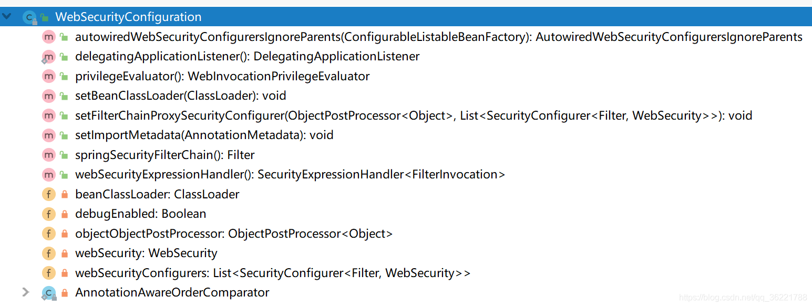
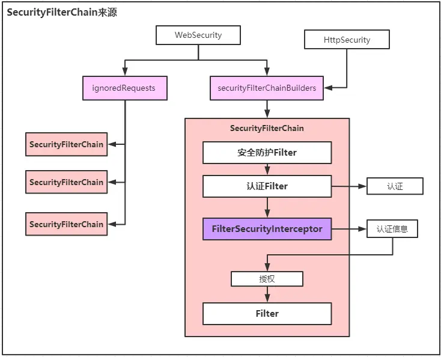

# Spring Security原理分析【2】——SecurityFilterChain的构建

> Spring Security整个框架的核心就是构建一个名字为 springSecurityFilterChain 的过滤器Bean，它的类型是 FilterChainProxy 。

## FilterChainProxy 是如何创建的？

在引入一个新的框架，框架中一些定义好的Bean如何注入我们的Spring容器中呢？

其实无非就是通过 @Import 引入相关的类。一般在使用 Spring Security 框架时，我们会自定义一个配置类，配置类加上 @EnableWebSecurity 注解，重新启动程序，一个使用了安全框架的项目就起来了，在无任何自定义配置情况下 Spring Security 默认配置了一个登录过滤器链。

加个 @EnableWebSecurity 注解就可以，怎么做到的？

我们查看@EnableWebSecurity的源码：

```java
@Retention(value = java.lang.annotation.RetentionPolicy.RUNTIME)
@Target(value = { java.lang.annotation.ElementType.TYPE })
@Documented
@Import({ WebSecurityConfiguration.class,
        SpringWebMvcImportSelector.class })
@EnableGlobalAuthentication
@Configuration
public @interface EnableWebSecurity {

    /**
     * Controls debugging support for Spring Security. Default is false.
     * @return if true, enables debug support with Spring Security
     */
    boolean debug() default false;
}
```

重点关注 @Import 导入的类 WebSecurityConfiguration ，会发现类中定义了很多Bean



其中就有我们的核心过滤器springSecurityFilterChain

```java
@Configuration
public class WebSecurityConfiguration implements ImportAware, BeanClassLoaderAware {
    ...
    /**
     * Creates the Spring Security Filter Chain
     * @return
     * @throws Exception
     */
    @Bean(name = AbstractSecurityWebApplicationInitializer.DEFAULT_FILTER_NAME)
    public Filter springSecurityFilterChain() throws Exception {
        boolean hasConfigurers = webSecurityConfigurers != null
                && !webSecurityConfigurers.isEmpty();
        if (!hasConfigurers) {
            WebSecurityConfigurerAdapter adapter = objectObjectPostProcessor
                    .postProcess(new WebSecurityConfigurerAdapter() {
                    });
            webSecurity.apply(adapter);
        }
        return webSecurity.build();
    }
    ...
}
```

这里涉及到了建造者WebSecurity，建造的产品为：Filter,具体类型为FilterChainProxy。

webSecurity.build()调用如下：

org.springframework.security.config.annotation.AbstractSecurityBuilder#build
org.springframework.security.config.annotation.AbstractConfiguredSecurityBuilder#doBuild

doBuild是一个模板方法：

```java
@Override
protected final O doBuild() throws Exception {
    synchronized (configurers) {
      buildState = BuildState.INITIALIZING;
      // ----- 初始化 -----
      beforeInit();
      init();

      buildState = BuildState.CONFIGURING;
      // ----- 配置属性 -----
      beforeConfigure();
      configure();

      buildState = BuildState.BUILDING;

      // ----- 建造产品 -----
      O result = performBuild();

      buildState = BuildState.BUILT;

      return result;
    }
}
```

核心构建方法 performBuild 方法在子类中具体实现，此处构建类为WebSecurity

```java
@Override
protected Filter performBuild() throws Exception {
     // 链长度
     int chainSize = ignoredRequests.size() + securityFilterChainBuilders.size();
     // SecurityFilterChain的构建
     List<SecurityFilterChain> securityFilterChains = new ArrayList<>(chainSize);
     // 第一部分：来自不需要安全保护请求：ignoredRequest
     for (RequestMatcher ignoredRequest : ignoredRequests) {
       securityFilterChains.add(new DefaultSecurityFilterChain(ignoredRequest));
     }
     // 第二部分：来自需要安全保护请求：securityFilterChainBuilders
     for (SecurityBuilder<? extends SecurityFilterChain> securityFilterChainBuilder : 
     securityFilterChainBuilders) {
       securityFilterChains.add(securityFilterChainBuilder.build());
     }
     // 构建代理类
     FilterChainProxy filterChainProxy = new FilterChainProxy(securityFilterChains);
     // 防火墙
     if (httpFirewall != null) {
       filterChainProxy.setFirewall(httpFirewall);
     }
     filterChainProxy.afterPropertiesSet();
     Filter result = filterChainProxy;
     // 后置处理
     postBuildAction.run();
     // 构建完毕
     return result;
}
```

FilterChainProxy代理的多条SecurityFilterChain最终只能走一条，因此SecurityFilterChain来源十分重要，上面的代码说明来源是2部分，这两部分都是WebSecurity的私有属性，也就是可以在任何可以获得WebSecurity实例的位置进行配置，但是一般都会按照规约进行，防止代理混乱、不易读。以下WebSecurity的2个属性分别表示2种来源：

```java
private final List<RequestMatcher> ignoredRequests = new ArrayList<>();
private final List<SecurityBuilder<? extends SecurityFilterChain>> securityFilterChainBuilders = new ArrayList<>();
```

这两种来源的SecurityFilterChain其实涉及了2种构建者：WebSecurity和HttpSecurity，前者基于Web应用（一般就是MVC）来构建安全，后者基于请求-响应（一般而言就是HTTP）来构建安全。

## WebSecurity & HttpSecurity

### WebSecurity

基于Servlet的Web应用的安全访问控制，Spring Security与Spring MVC紧密集成。在WebSecurity可以进行整体的配置，优先级最高。

来源之一：ignoredRequests

WebSecurity内部类IgnoredRequestConfigurer提供了配置ignoredRequests的功能，并且提供了mvcMatchers(String... mvcPatterns)和mvcMatchers(HttpMethod method,String... mvcPatterns)两种配置入口。通过WebSecurity#ignoring方法就能拿到该对象实例并完成配置：该配置符合链式调用，每个IgnoredRequestConfigurer都可以构建一条SecurityFilterChain。

```java
//继承WebSecurityConfigurerAdapter抽象类重写方法
@Override
public void configure(WebSecurity web) throws Exception {
  super.configure(web);
  // 获取IgnoredRequest配置对象
  web.ignoring()
      // 链式调用   
     .mvcMatchers("/login")
      // 链式调用  
     .mvcMatchers("/home")
  ;
}
```

### HttpSecurity

基于网络请求的安全访问控制，在Servlet中网络请求主要在Filter中，这部分主要是配置的Http请求流转过程中的安全。

来源之一：securityFilterChainBuilders

大部分开发使用的就是这种来源，每个实例构建一条SecurityFilterChain。WebSecurity提供了addSecurityFilterChainBuilder方法来配置，因此通过WebSecurity实例也能完成配置，但securityFilterChainBuilder构建流程复杂，一般都使用Spring Security提供的内置方法来简化这个流程，例如在WebSecurityConfigurerAdapter#init中就默认调用了addSecurityFilterChainBuilder（HttpSecurity）

```java
//继承WebSecurityConfigurerAdapter抽象类重写方法
@Override
protected void configure(HttpSecurity http) throws Exception {
    http.authorizeRequests()
        .antMatchers("/").permitAll()
        .anyRequest().authenticated()
        .and()
        .formLogin()
        .loginPage("/login")
        .permitAll()
        .and()
        .logout()
        .permitAll();
}
```

HttpSecurity主要配置Filter链，也就是SecurityFilterChain的来源，也是最常见的，当然也是最重要的，下面为默认的配置：

```java
http = new HttpSecurity(objectPostProcessor, authenticationBuilder,sharedObjects);
if (!disableDefaults) {
    // @formatter:off
    http
        .csrf().and()
        .addFilter(new WebAsyncManagerIntegrationFilter())
        .exceptionHandling().and()
        .headers().and()
        .sessionManagement().and()
        .securityContext().and()
        .requestCache().and()
        .anonymous().and()
        .servletApi().and()
        .apply(new DefaultLoginPageConfigurer<>()).and()
        .logout();
    // @formatter:on
    ClassLoader classLoader = this.context.getClassLoader();
    // 拿出IOC容器中所有AbstractHttpConfigurer具体类，逐个配置
    List<AbstractHttpConfigurer> defaultHttpConfigurers = 
        SpringFactoriesLoader.loadFactories(AbstractHttpConfigurer.class, classLoader);
    for (AbstractHttpConfigurer configurer : defaultHttpConfigurers) {
        http.apply(configurer);
    }
}
// 常见的配置方法：protected void configure(HttpSecurity http) throws Exception {
configure(http);
```

这里默认会加入10个Configurer，每个对应一个Filter，defaultHttpConfigurers默认为空，可以自定义Bean来注册，会覆盖默认配置，再加上配置的WebAsyncManagerIntegrationFilter和平时常用的formLogin总共12个Filter，各种Filter之间时有序的。

configure(http);方法则是开发者重写的方法，用于扩展SecurityFilterChain中的Filter，同样此处定义会覆盖前面默认配置,每种configurer都与对应一种Filter。

0、authorizeRequests --> ExpressionUrlAuthorizationConfigurer --> FilterSecurityInterceptor

功能：配置基于请求路径的安全访问规则：ConfigAttribute

1、ChannelSecurityConfigurer --> ChannelProcessingFilter

功能：配置Web请求通道转换后重定向，默认两种：安全的https->443、不安全的http->80,不区分的权限标识为："ANY_CHANNEL"。如果不需要https保护接口，则不用配置该过滤器。

2、WebAsyncManagerIntegrationFilter

功能：将SecurityContext配置到异步请求WebAsyncManager中，MVC支持异步Controller，返回对象为：DeferredResult等。

3、ConcurrentSessionFilter

功能：对于session存在的请求，验证session是否过期，如果过期，则调用doLogout方法，否则更新session的访问时间。默认不启用该Filter，可以在sessionManagement#maximumSessions控制。

4、securityContext --> SecurityContextPersistenceFilter

功能：持久化SecurityContext，即Security上下文，使得能从线程中获取到当前登录用户的信息，持久化方式默认是HttpSessionSecurityContextRepository即服务器Session，key="SPRING_SECURITY_CONTEXT"。

5、headers --> HeadersConfigurer --> HeaderWriterFilter

功能：在请求响应的头部添加自定义信息

6、cors -> CorsConfigurer -> CorsFilter

功能：跨域处理，注意这个过滤器是Spring Security内部过滤器，在优先级更高过滤器中就返回的响应不会具有跨域能力

7、csrf --> CsrfConfigurer --> CsrfFilter

功能：跨站请求攻击防御,默认对"GET", "HEAD", "TRACE", "OPTIONS"请求进行CSRF保护，默认为session中保存CsrfToken,前后端进行验证。

8、logout --> LogoutConfigurer --> LogoutFilter

功能：匹配路径登出

9、formLogin --> FormLoginConfigurer --> UsernamePasswordAuthenticationFilter

功能：使用账号、密码模式的UsernamePasswordAuthenticationToken身份认证

10、DefaultLoginPageConfigurer --> DefaultLoginPageGeneratingFilter && DefaultLogoutPageGeneratingFilter

功能： 在未指定登录登出页面时，生成默认的页面

11、httpBasic --> HttpBasicConfigurer --> BasicAuthenticationFilter

功能：通过UsernamePasswordAuthenticationToken处理请求头中Basic格式的Authorization认证信息

12、requestCache --> RequestCacheConfigurer --> RequestCacheAwareFilter

功能：用来恢复登录流程中被中断（认证失败）的请求。

在RequestCacheConfigurer中对HttpRequest缓存条件加了以下默认限制：

- Csrf开启时：只能为GET请求
- 不缓存网站图标请求：即路径不能匹配“/**/favicon.*”
- 不缓存这三种媒体类型MediaType："application/json"、"multipart/form-data"、"text/event-stream"
- 不缓存xjax请求，即请求头"X-Requested-With"不能为："XMLHttpRequest"

13、servletApi --> ServletApiConfigurer --> SecurityContextHolderAwareRequestFilter

功能：实现Servlet3 API接口，主要在SecurityContextHolderAwareRequestWrapper重写实现，例如getRemoteUser、getUserPrincipal、isUserInRole

14、rememberMe --> RememberMeConfigurer --> RememberMeAuthenticationFilter

功能：当用户没有登录而访问web资源时，可以从cookie或者内存中找出身份识别信息从而静默登录

15、anonymous --> AnonymousConfigurer --> AnonymousAuthenticationFilter

功能：当Security Context中认证信息为null时设置Security Context=AnonymousAuthenticationToken，默认权限为"ROLE_ANONYMOUS"

16、sessionManagement --> SessionManagementConfigurer --> SessionManagementFilter

功能：针对未持久化过SecurityContext的请求进行session会话固定（Session fixation）保护和限制用户打开会话数量。

17、exceptionHandling --> ExceptionHandlingConfigurer --> ExceptionTranslationFilter

功能：处理Spring Security流程中出现的异常，主要就是AuthenticationException和AccessDeniedException异常，获取到异常一般都会交给对应的AuthenticationEntryPoint#commence去处理，但是非AnonymousAuthenticationToken或者RememberMeAuthenticationToken产生的AccessDeniedException会交给过滤器中的accessDeniedHandler来处理（例如：403）

过滤器有排序的，整体排序如下：

```java
FilterComparator() {
    Step order = new Step(INITIAL_ORDER, ORDER_STEP);
    put(ChannelProcessingFilter.class, order.next());
    put(ConcurrentSessionFilter.class, order.next());
    put(WebAsyncManagerIntegrationFilter.class, order.next());
    put(SecurityContextPersistenceFilter.class, order.next());
    put(HeaderWriterFilter.class, order.next());
    put(CorsFilter.class, order.next());
    put(CsrfFilter.class, order.next());
    put(LogoutFilter.class, order.next());
    filterToOrder.put("org.springframework.security.oauth2.client.web.OAuth2AuthorizationRequestRedirectFilter",order.next());
    filterToOrder.put("org.springframework.security.saml2.provider.service.servlet.filter.Saml2WebSsoAuthenticationRequestFilter",order.next());
    put(X509AuthenticationFilter.class, order.next());
    put(AbstractPreAuthenticatedProcessingFilter.class, order.next());
    filterToOrder.put("org.springframework.security.cas.web.CasAuthenticationFilter",order.next());
    filterToOrder.put("org.springframework.security.oauth2.client.web.OAuth2LoginAuthenticationFilter",order.next());
    filterToOrder.put("org.springframework.security.saml2.provider.service.servlet.filter.Saml2WebSsoAuthenticationFilter",order.next());
    put(UsernamePasswordAuthenticationFilter.class, order.next());
    put(ConcurrentSessionFilter.class, order.next());
    filterToOrder.put("org.springframework.security.openid.OpenIDAuthenticationFilter", order.next());
    put(DefaultLoginPageGeneratingFilter.class, order.next());
    put(DefaultLogoutPageGeneratingFilter.class, order.next());
    put(ConcurrentSessionFilter.class, order.next());
    put(DigestAuthenticationFilter.class, order.next());
    filterToOrder.put("org.springframework.security.oauth2.server.resource.web.BearerTokenAuthenticationFilter", order.next());
    put(BasicAuthenticationFilter.class, order.next());
    put(RequestCacheAwareFilter.class, order.next());
    put(SecurityContextHolderAwareRequestFilter.class, order.next());
    put(JaasApiIntegrationFilter.class, order.next());
    put(RememberMeAuthenticationFilter.class, order.next());
    put(AnonymousAuthenticationFilter.class, order.next());
    filterToOrder.put("org.springframework.security.oauth2.client.web.OAuth2AuthorizationCodeGrantFilter",order.next());
    put(SessionManagementFilter.class, order.next());
    put(ExceptionTranslationFilter.class, order.next());
    put(FilterSecurityInterceptor.class, order.next());
    put(SwitchUserFilter.class, order.next());
}
```

注意排序中FilterSecurityInterceptor的优先级别很低，防御的是Web中方法级别的安全。最终SecurityFilterChain来源如图示下：



## FilterSecurityInterceptor认证、授权核心入口

针对方法级别的拦截：区分为前置拦截：beforeInvocation和后置拦截：afterInvocation，前后拦截原理基本一致。

这是开发者经常接触方式，这种模式引入一个专有名词：ConfigAttribute，直译：属性配置，但是对于开发而已可以称为：安全访问规则。

可以对任何路径配置（每个Controller方法其实对应的就是访问路径）安全访问规则。权限标识属于一种安全访问规则。

对安全访问规则ConfigAttribute能否满足访问资源的权限的决断，由AccessDecisionManager处理，AccessDecisionManager特定访问规则的web资源能否被访问。

而AccessDecisionManager做出决断需要当前账号的认证信息，因此在做出决断之前会尝试通过AuthenticationManager获取当前请求的身份认证信息。

这里获取认证信息、做出访问决断是Spring Security的另一个核心。
