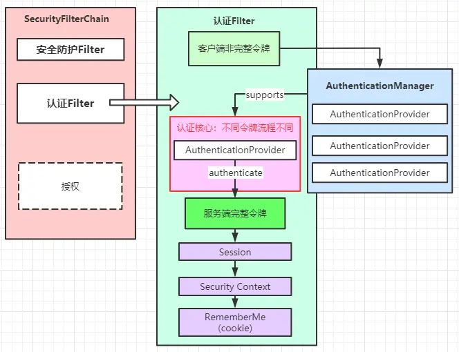
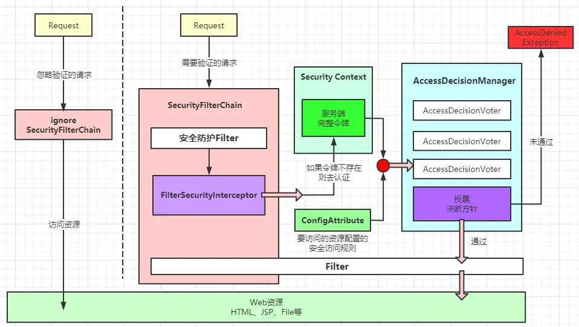

# SpringSecurity 原理解析【3】——认证与授权

在上篇文章中提到构建SecurityFilterChain过程中存在一个方法级别的过滤器：FilterSecurityInterceptor。该过滤器统一调用了认证和授权两种功能，而Spring Security主要就做这2件事，1： 身份认证（谁在发起请求），2：身份授权（是否有权限访问资源）。但是需要明确一点：FilterSecurityInterceptor主要做的是基于访问规则的身份授权。而身份认证是身份授权的前提，因此FilterSecurityInterceptor会在认证信息不存在时进行一次身份认证。正常认证流程是在其他优先级更高的过滤器完成的身份认证，当然二者的认证流程一致：

- 通过AuthenticationManager获取当前请求的身份认证信息
- 通过AccessDecisionManager决断特定访问规则的web资源能否被访问

## 身份认证

身份认证就是辨别出当前请求是谁发出的。在Spring Security中，哪怕不需要知道某个请求是谁发出的，也会给这个请求的来源构建一个身份信息：匿名身份。

对于需要知道请求的身份信息的，则需要客户端提供身份标识码和开发者提供身份识别档案信息，二者比对之后才能做出到底是哪个具体身份的决断。客户端提供的身份标识被抽象为令牌Token，提供身份档案信息的方式抽象为：认证提供者AuthenticationProvider。

### 身份识别令牌

一个完整的身份识别令牌应该能展示以下信息：

- 令牌所属人：Principal
- 所属人的身份认证凭证：Credentials
- 所属人附加信息：Details
- 所属人的权限信息：Authorities。

在Spring Security中使用Authentication表示：

```java
public interface Authentication extends Principal, Serializable {
    // 授权集合：GrantedAuthority实现类
    Collection<? extends GrantedAuthority> getAuthorities();
    // 凭证：【密码】
    Object getCredentials();
    // 详情：【其他信息】
    Object getDetails();
    // 主体：【账号】  
    Object getPrincipal();
    // 是否已认证：true为已认证
    boolean isAuthenticated();
    // 设置是否已认证：
    void setAuthenticated(boolean var1) throws IllegalArgumentException;
}
```

客户端不能提供完整的身份识别令牌，因为客户端的信息并不可靠，因此一般而言客户端不需要提供完整的令牌信息，只需要提供能识别出所属人Principal的识别码即可，剩余的信息交给服务端去填充。Spring Security的身份认证过程就是对身份识别令牌的填充过程。

所有的令牌都是Authentication的子类，令牌提供所属人识别码来填充完整令牌所属人信息。根据令牌识别码的提供方式不同，令牌实现也不同，常见提供方式有：账号密码、手机号、Cookie、Jwt、第三方授权码、图形验证码等等。而Spring Security中内置的令牌具有：RememberMeAuthenticationToken（静默登录令牌）、AnonymousAuthenticationToken（匿名访问令牌）、UsernamePasswordAuthenticationToken（账号密码令牌）、PreAuthenticatedAuthenticationToken（提前认证令牌）、RunAsUserToken（身份转换令牌）等。

### 以账号密码令牌为例

Spring Security对账号密码令牌的支持为：UsernamePasswordAuthenticationToken，想使用该令牌进行身份识别需要在SecurityFilterChain中添加UsernamePasswordAuthenticationFilter。当然配置方式还是在HttpSecurity处配置：

```java
@Override
protected void configure(HttpSecurity http) throws Exception {
    http.authorizeRequests()
        // 登录页不需要权限就能访问
        .antMatchers("/login.html").permitAll()
        .anyRequest().authenticated()
        .and()
        // 使用UsernamePasswordAuthenticationToken作为客户端使用的身份识别令牌
        .formLogin()
        // 登录页面
        .loginPage("/login.html")
        // 进行身份识别匹配的路径，这是一个POST方式的请求匹配器
        .loginProcessingUrl("/doLogin")
        // 身份识别成功之后的重定向展示页面
        .defaultSuccessUrl("/home.html",false)
        // 身份识别失败之后的重定向提示页面
        .failureUrl("/login.html?error=1")
        .and()
        .logout()
    ;
}
```

无论何种令牌，都需指定进行认证操作的请求路径：AuthenticationURL。在账号密码令牌中，该认证路径使用loginProcessingUrl属性配置，并默认为POST方式的AntPathRequestMatcher。该匹配器在父类AbstractAuthenticationProcessingFilter中，通过requiresAuthentication来判断是否需要认证。如果当前请求是匹配的认证路径，则认证方法如下：

```java
Authentication authResult = attemptAuthentication(request, response);
```

UsernamePasswordAuthenticationFilter实现简化为：

```java
public Authentication attemptAuthentication(HttpServletRequest request, HttpServletResponse response) 
            throws AuthenticationException {
    // 请求中获取参数
    String username = obtainUsername(request);
    String password = obtainPassword(request);
    // 构建令牌
    UsernamePasswordAuthenticationToken authRequest = new UsernamePasswordAuthenticationToken(username, password);
    // 设置Details
    setDetails(request, authRequest);
    // 认证入口：AuthenticationManager#authenticate
    return this.getAuthenticationManager().authenticate(authRequest);
}
```

无论何种令牌，在初步构建之后都会交给AuthenticationManager#authenticate来完成认证。这里就引入了Spring Security的身份认证核心对象：认证管理器：AuthenticationManager。可以这么理解：处理好了客户端的非完整令牌，那么服务端就需要来逐步完善这个令牌。认证管理器作为总的管理者，统一管理入口。

#### ProviderManager

AuthenticationManager是一个接口规范，其实现类为：ProviderManager，提供者管理器：管理能提供身份档案信息的对象（AuthenticationProvider），能证明令牌确实是属于某个身份，能证明的方式有很多，Spring Security不是多方验证，而是首次验证成功即可，也就是说虽然有很多方式能证明令牌真的属于谁，但是Spring Security只需要一个能提供证明身份证明的档案即可。ProviderManager是一个父子分层结构，如果都不能证明则会去父管理器中去证明。ProviderManager主要结构如下：

```java
public class ProviderManager implements AuthenticationManager, 
    MessageSourceAware,
    InitializingBean {
    ...
    // 管理多个AuthenticationProvider（认证提供者）
    private List<AuthenticationProvider> providers = Collections.emptyList();
    // 父管理器
    private AuthenticationManager parent;
    ...
}
```

#### AuthenticationProvider

AuthenticationProvider作为一个能提供身份档案信息的接口规范，主要规范认证功能，针对特定令牌提供supports功能，而且基于职责单一原则，每种Token都会有一个AuthenticationProvider实现。

```java
public interface AuthenticationProvider {

    // Token令牌身份识别
    Authentication authenticate(Authentication authentication) throws AuthenticationException;
    // 是否支持某种类型的Token令牌
    boolean supports(Class<?> authentication);
}
```

#### 以账号密码认证提供者为例

此种令牌是客户端提供账号、密码来作为识别码进行身份识别的认证方式，因此服务端应该会有一个存储大量账号、密码和其他信息的地方。Spring Security将一个能存储用户认证信息的对象抽象为：UserDetails。

```java
public interface UserDetails extends Serializable {
    //授权集合
    Collection<? extends GrantedAuthority> getAuthorities();
    // 密码
    String getPassword();
    //账号
    String getUsername();
    //账号是否过期
    boolean isAccountNonExpired();        //认证前置校验
    //账号是否锁定
    boolean isAccountNonLocked();         //认证前置校验
    // 凭证是否过期
    boolean isCredentialsNonExpired();    //认证后置校验
    //账号是否禁用
    boolean isEnabled();                  //认证前置校验
}
```

认证提供者需要做的就是从存储的库中找到对应的UserDetails。DaoAuthenticationProvider就是通过数据访问（Data Access Object）来获取到认证对象的档案信息的。获取的实现交给了开发者，实现UserDetailsService#loadUserByUsername方法

```java
UserDetails loadedUser = this.getUserDetailsService().loadUserByUsername(username);
```

获取到UserDetails就可以去认证了，流程简化如下：

```java
public Authentication authenticate(Authentication authentication) throws AuthenticationException {
    // 矫正账户名
    String username = (authentication.getPrincipal() == null) ? "NONE_PROVIDED" : authentication.getName();
    // 获取认证凭证
    UserDetails user = this.getUserDetailsService().loadUserByUsername(username);
    // 前置账号检测：是否上锁：LockedException，是否禁用：DisabledException，是否失效：AccountExpiredException
    preAuthenticationChecks.check(user);
    // 主体检测：抽象方法：默认为密码匹配检测
    additionalAuthenticationChecks(user,(UsernamePasswordAuthenticationToken) authentication);
    // 后置凭证检测：凭证是否失效：CredentialsExpiredException
    postAuthenticationChecks.check(user);
    // 返回填充完整的令牌
    return createSuccessAuthentication(principalToReturn, authentication, user);
}
```

完整的令牌是UsernamePasswordAuthenticationToken的一个新的实例，各种认证信息齐全。

#### 令牌完整后续处理

身份识别成之后就会得到一个完整的令牌。后续则会处理Session（会话相关）、Security Context（上下文相关）、RememberMe（静默登录相关）、SuccessHandler（成功之后跳转相关）

### 身份认证流程

至此身份认证流程完毕，登录成功之后一般都会根据SuccessHandler跳转的固定页面，从而开启访问授权决断相关流程。认证流程图示如下：



## 身份授权

身份认证成功就能够判断令牌属于谁，身份授权则判断该身份能否访问指定资源。在上篇文章说了SecurityFilterChain的构建来源，除了被忽略的认证和被其他过滤器拦截的，剩下的基本都是基于安全访问规则（ConfigAttribute）的判断了。判断入口在FilterSecurityInterceptor#invoke

### 安全访问规则：ConfigAttribute

从代码中收集安全访问规则，主要存在以下类型：

- WebExpressionConfigAttribute

基于Web表达式的访问规则，目前只有一个来源：ExpressionUrlAuthorizationConfigurer，HttpSecurity默认使用的就是该类：

```java
http.authorizeRequests()
        .antMatchers("/index").access("hasAnyRole('ANONYMOUS', 'USER')")
        .antMatchers("/login/*").access("hasAnyRole('ANONYMOUS', 'USER')")
```

- SecurityConfig

基于配置类的访问规则,常规用法基本都是该对象，例如@Secured、@PermitAll、@DenyAll 和 UrlAuthorizationConfigurer（HttpSecurity可配置）

```java
@GetMapping("/{id}")
@PermitAll()
public Result<Integer> find(@PathVariable Long id) {
    return Result.success(service.find(id));
}
```

- PreInvocationExpressionAttribute

基于AOP前置通知表达式的访问规则，主要是对@PreFilter 和 @PreAuthorize，这也是最常用的

```java
@DeleteMapping("/{id}")
@PreAuthorize("hasAuthority('del')")
public Result<Boolean> deleteById(@PathVariable Long id) {
    return Result.success(service.deleteById(id));
}
```

- PostInvocationExpressionAttribute

基于AOP后置通知调用表达式的访问规则，主要是对@PostFilter 和 @PostAuthorize

```java
@GetMapping("/{id}")
@PostAuthorize("returnObject.data%2==0")
public Result<Integer> find(@PathVariable Long id) {
    return Result.success(service.find(id));
}
```

### 授权模型

为了便于开发，设计的安全访问规则来源有好几种，不同的安全访问规则需要不同的处理机制来解析。能对某种安全访问规则做出当前请求能否通过该规则并访问到资源的决断的对象在Spring Security中抽象为AccessDecisionVoter：选民，做出决断的动作称为：vote：投票。AccessDecisionVoter只能对支持的安全访问规则做出赞成、反对、弃权之一的决断，每个决断1个权重。接口规范如下：

```java
public interface AccessDecisionVoter<S> {

    // 赞成票
    int ACCESS_GRANTED = 1;
    // 弃权票
    int ACCESS_ABSTAIN = 0;
    // 反对票
    int ACCESS_DENIED = -1;

    /**
     *  是否支持对某配置数据进行投票 
     */
    boolean supports(ConfigAttribute attribute);

    /**
     * 是否支持对某类型元数据进行投票 
     */
    boolean supports(Class<?> clazz);

    /**
     *  对认证信息进行投票
     */
    int vote(Authentication authentication, S object,Collection<ConfigAttribute> attributes);
}
```

Spring Security中对安全访问规则的最终决断是基于投票结果然后根据决策方针才做出的结论。能做出最终决断的接口为：AccessDecisionManager。

```java
// 做出最终决断的方法#
void decide(Authentication authentication, Object object, Collection<ConfigAttribute> configAttributes) 
  throws AccessDeniedException, InsufficientAuthenticationException;
```

抽象实现为AbstractAccessDecisionManager，它管理多个选民AccessDecisionVoter

```java
private List<AccessDecisionVoter<?>> decisionVoters;
```

AbstractAccessDecisionManager，具体类为决策方针，目前有三大方针，默认为：一票通过方针：AffirmativeBased。

### 决策方针

#### AffirmativeBased【一票通过方针】

```java
public void decide(Authentication authentication, Object object,Collection<ConfigAttribute> configAttributes) 
            throws AccessDeniedException {
    ...
    for (AccessDecisionVoter voter : getDecisionVoters()) {
        int result = voter.vote(authentication, object, configAttributes);
        switch (result) {
        // 一票同意
        case AccessDecisionVoter.ACCESS_GRANTED:
            return;
        ...
    }
}
```

#### ConsensusBased【少数服从多数方针】

```java
public void decide(Authentication authentication, Object object,Collection<ConfigAttribute> configAttributes) 
            throws AccessDeniedException {
    ...
    for (AccessDecisionVoter voter : getDecisionVoters()) {
        int result = voter.vote(authentication, object, configAttributes);
        switch (result) {
        case AccessDecisionVoter.ACCESS_GRANTED: grant++; break;
        case AccessDecisionVoter.ACCESS_DENIED: deny++; break;
        default: break;
        }
    }
    // 多数同意才有效
    if (grant > deny) {
        return;
    }
    // 少数同意，决策无效
    if (deny > grant) {
        throw new AccessDeniedException(messages.getMessage(
                    "AbstractAccessDecisionManager.accessDenied", "Access is denied"));
    }
    // 票数相等则根据allowIfEqualGrantedDeniedDecisions来决定是否通过
    if ((grant == deny) && (grant != 0)) {
        if (this.allowIfEqualGrantedDeniedDecisions) {
            return;
        }
        else {
            throw new AccessDeniedException(messages.getMessage(
                    "AbstractAccessDecisionManager.accessDenied", "Access is denied"));
        }
    }
    ...
}
```

#### UnanimousBased【一票否决方针】

```java
public void decide(Authentication authentication, Object object,Collection<ConfigAttribute> attributes) 
            throws AccessDeniedException {
    ...
    for (AccessDecisionVoter voter : getDecisionVoters()) {
        int result = voter.vote(authentication, object, singleAttributeList);
        switch (result) {
        ...
        // 一票否决
        case AccessDecisionVoter.ACCESS_DENIED:
            throw new AccessDeniedException(messages.getMessage(
                    "AbstractAccessDecisionManager.accessDenied",
                    "Access is denied"));
        ...
    }
    ...
}
```

### 选民类型

决策方针的执行需要选民参与投票，三大决策都是通过遍历decisionVoters来统计vote结果的。不同的decisionVoter解析不同的安全访问规则，因此当一个访问规则需要决断时，只有支持当前访问规则的decisionVoter才能做出决断。因此需要知道一个访问规则会被哪种decisionVoter解析。

#### 基于角色的选民【RoleVoter】

针对具有角色权限标识的安全访问规则进行投票，角色权限标识特征：private String rolePrefix = "ROLE_";，在Spring Security中角色权限都是该字符前缀，当对用户是否拥有该角色权限时，就需要通过RoleVoter进行投票，注：前缀可配置

```java
public int vote(Authentication authentication, Object object, Collection<ConfigAttribute> attributes) {
    if (authentication == null) {
        return ACCESS_DENIED;
    }
    int result = ACCESS_ABSTAIN;
    // 从Token令牌中提取已授权集合
    Collection<? extends GrantedAuthority> authorities = extractAuthorities(authentication);
    // 先判断选民是否支持对该属性进行投票
    for (ConfigAttribute attribute : attributes) {
        if (this.supports(attribute)) {
            result = ACCESS_DENIED;
            // 当支持时，则从已授权集合中获取到该权限标识，如果获取不到则表示无权限，投反对票
            // 已授权集合在身份认证时已获取
            for (GrantedAuthority authority : authorities) {
                if (attribute.getAttribute().equals(authority.getAuthority())) {
                    return ACCESS_GRANTED;
                }
            }
        }
    }
    return result;
}
```

#### 基于角色分级的选民【RoleHierarchyVoter】

在RoleVoter基础上，将角色分级，高级别的角色将自动拥有低级别角色的权限，使用方式为角色名称之间通过大于号“>”分割，前面的角色自动拥有后面角色的权限

```java
@Override
Collection<? extends GrantedAuthority> extractAuthorities( Authentication authentication) {
    // 提取权限集合时，会将低级别角色的权限也获取到
    return roleHierarchy.getReachableGrantedAuthorities(authentication.getAuthorities());
}
```

分割方法

```java
String[] roles = line.trim().split("\\s+>\\s+");
```

#### 基于认证令牌的选民【AuthenticatedVoter】

针对固定的权限标识进行投票，这种标识有三个：全权授权：IS_AUTHENTICATED_FULLY、RememberMe授权

IS_AUTHENTICATED_REMEMBERED、匿名访问授权

IS_AUTHENTICATED_ANONYMOUSLY。但是每种权限需要指定的Token才能投赞成票，这里引入了AuthenticationTrustResolver，主要就是判断是否为Anonymous或者RememberMe

IS_AUTHENTICATED_REMEMBERED：需要认证令牌为：RememberMeAuthenticationToken或者其子类(AuthenticationTrustResolver默认实现)，才能对该标识投赞成票

IS_AUTHENTICATED_ANONYMOUSLY：需要认证令牌为：AnonymousAuthenticationToken或者其子类(AuthenticationTrustResolver默认实现)，才能对该标识投赞成票

IS_AUTHENTICATED_FULLY：需要认证令牌不是以上两种令牌，才能对该标识投赞成票

#### 基于Web表达式的选民【WebExpressionVoter】

针对于Web表达式的权限控制，表达式的解析处理器为SecurityExpressionHandler，解析时使用的是SPEL解析器：SpelExpressionParser。

SecurityExpressionHandler能对以上所有投票方式进行解析，解析结果为Boolean，true则表示赞成，false则表示反对。

```java
// 只支持Web表达式的属性
public boolean supports(ConfigAttribute attribute) {
    return attribute instanceof WebExpressionConfigAttribute;
}
// 只支持FilterInvocation类型
public boolean supports(Class<?> clazz) {
    return FilterInvocation.class.isAssignableFrom(clazz);
}
```

#### 前置调用增强的投票者【PreInvocationAuthorizationAdviceVoter】

同样是基于SPEL表达式，但该表达式只针对方法级别的@PreFilter 和 @PreAuthorize，解析器为：MethodSecurityExpressionHandler。

```java
public int vote(Authentication authentication, MethodInvocation method, Collection<ConfigAttribute> attributes) {
    // @PreFilter 和 @PreAuthorize增强获取
    PreInvocationAttribute preAttr = findPreInvocationAttribute(attributes);
    if (preAttr == null) {
        return ACCESS_ABSTAIN;
    }
    // EL表达式解析 
    boolean allowed = preAdvice.before(authentication, method, preAttr);
    // 解析结果投票
    return allowed ? ACCESS_GRANTED : ACCESS_DENIED;
}
```

#### 基于Jsr250规范的投票者【Jsr250Voter】

针对Jsr250规范的注解@PermitAll和@DenyAll控制的权限，前置投赞成票，后置投反对票。对于supports的权限投赞成票

```java
public int vote(Authentication authentication, Object object, Collection<ConfigAttribute> definition) {
    boolean jsr250AttributeFound = false;
    for (ConfigAttribute attribute : definition) {
        //@PermitAll 赞成
        if (Jsr250SecurityConfig.PERMIT_ALL_ATTRIBUTE.equals(attribute)) {
            return ACCESS_GRANTED;
        }
        //@DenyAll 反对
        if (Jsr250SecurityConfig.DENY_ALL_ATTRIBUTE.equals(attribute)) {
            return ACCESS_DENIED;
        }
        //supports
        if (supports(attribute)) {
            jsr250AttributeFound = true;
            // 如果已授权则投赞成票
            for (GrantedAuthority authority : authentication.getAuthorities()) {
                if (attribute.getAttribute().equals(authority.getAuthority())) {
                    return ACCESS_GRANTED;
                }
            }
        }
    }
    // 未授权但是support的投反对票，未support的弃权
    return jsr250AttributeFound ? ACCESS_DENIED : ACCESS_ABSTAIN;
}
```

## 授权整体流程

以上就是Spring Security对授权功能的实现，如果决断的最终结果是通过，则Filter会继续执行下去，否则会抛出异常。授权整体流程如下图：


