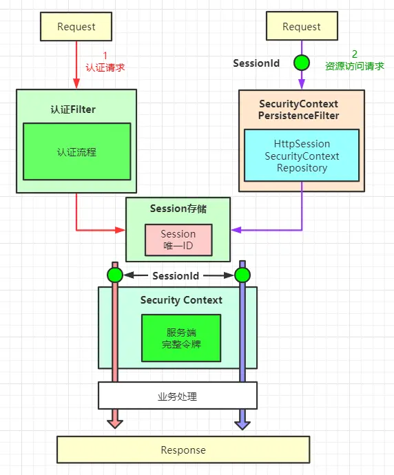

# SpringSecurity 原理解析【4】——令牌还原与Session

Session：一般称为会话，不同环境中含义不同，在Spring Security中一个会话指：客户端从令牌认证请求到登出注销请求之间的过程。Web应用基本都是基于HTTP协议，而该协议是一个无状态协议，两个HTTP请求相互独立，无法识别对方，在Web应用特别是Spring Security等安全框架中，同一个客户端发出的多个请求，如果不能识别出，每个请求都需要认证过程，这对于每次请求都需要主动提供身份识别信息的客户端而言绝对是一个灾难。因此需要一个方案来解决这个问题：解决方案整体而言只有一个：就给相关的HTTP请求添加一个全局总线，将这些HTTP请求打上统一标志来说明这些请求都是来自同一个身份。而实现目前主流两种：Session 和 WebToken,前者为主流标准Web应用总线方案实现，标志打在Cookie或者URL上，后者为主流前后端分离Web应用总线方案实现，标志打在请求头上。

今天主要说明前者Session。在JavaEE中Session特指HttpSession，其规范是在服务器端定义且实现的：默认每个请求都会具有一个Session实例。

```java
public interface HttpSession {
    
    // 创建时间
    long getCreationTime();
    
    boolean isNew();

    // 唯一ID
    String getId();

    // 最近一次访问时间
    long getLastAccessedTime();

    //Servlet上下文
    ServletContext getServletContext();

    // 具有失效能力
    void invalidate();
    
    void setMaxInactiveInterval(int var1);

    int getMaxInactiveInterval();

    // 具有存储能力    
    Object getAttribute(String var1);

    Enumeration<String> getAttributeNames();

    void setAttribute(String var1, Object var2);

    void removeAttribute(String var1);

}
```

此时可以这么理解Session：是一个具有唯一标识且可控生命周期的存储结构，底层一般为：ConcurrentMap<String, Object>。

## Session追踪

会话追踪：SessionTracking，意思是追踪Session来源，也就是从哪里开始查找总线标记，默认为Cookie和UR。

```java
public enum SessionTrackingMode {
    COOKIE, URL, SSL
}
```

Cookie就是将sessionId写入Cookie，URL则是在重定向时将sessionId写入URL。而解析Cookie或者URL是在HttpServer内部完成的，例如：tomcat、undertow。所以一般看不到Session构建的细节（不同服务器实现不一样），例如Tomcat服务器在构建Request时在CoyoteAdapter#postParseRequest，解析SessionId顺序为URL --> Cookie --> SSL ，且Cookie优先级最高，URL次之。

虽然不用知道如何解析Session，但是JavaEE给出构建入口和构建要求：HttpServletRequest#getSession，默认情况下session的构建交给HttpServer完成，但对于分布式应用，可以由Spring Session模块接手Session的生命周期。

注意如果会话追踪ID丢失，则会导致Session==null，后续所有依赖了Session存储的功能就会失败：例如：CsrfFilter

```java
// 主动确定返回的Session是否需要重新构建
HttpSession getSession(boolean var1);

// 获取当前请求的Session实例，如果不存在则构建
HttpSession getSession();

// 修改SessionId
String changeSessionId();

// Session有效性：是否存活
boolean isRequestedSessionIdValid();
// Session构建来源：是否从Cookie中解析
boolean isRequestedSessionIdFromCookie();
// Session构建来源：是否从URL中解析
boolean isRequestedSessionIdFromURL();
```

在Spring Security中在服务端完善令牌之后，可以从上篇文章图示中看到：令牌完整之后进行了Session、Context和Cookie管理。

Session的处理是通过SessionAuthenticationStrategy来执行的。默认是组合（Composite）策略，内置：ChangeSessionIdAuthenticationStrategy，复用现有Session，修改其唯一标识。

```java
CsrfAuthenticationStrategy (org.springframework.security.web.csrf)
ConcurrentSessionControlAuthenticationStrategy (org.springframework.security.web.authentication.session)
RegisterSessionAuthenticationStrategy (org.springframework.security.web.authentication.session)
CompositeSessionAuthenticationStrategy (org.springframework.security.web.authentication.session)
NullAuthenticatedSessionStrategy (org.springframework.security.web.authentication.session)
AbstractSessionFixationProtectionStrategy (org.springframework.security.web.authentication.session)
ChangeSessionIdAuthenticationStrategy (org.springframework.security.web.authentication.session)
SessionFixationProtectionStrategy (org.springframework.security.web.authentication.session)
```

在Session做了案底之后就可以在后续请求中获取到并还原了。

## 令牌还原

在Spring Security中有一个优先级很高的过滤器：SecurityContextPersistenceFilter：上下文持久化过滤器，还记得在FilterSecurityInterceptor中获取服务端完整令牌就是从SecurityContext中获取的吗？

```java
SecurityContext contextBeforeChainExecution = securityContextRepository.loadContext(holder);
```

这里有个SecurityContextRepository，安全上下文存储库，默认是HttpSessionSecurityContextRepository，也就是从HttpSession中获取到的上下文。而HttpSession则在会话追踪中已经还原了。

```java
// -------------------------------- session 存储 ------------------------------
// 先获取到请求中的Session
HttpSession httpSession = request.getSession(false);
// 从Session中获取SecurityContext
SecurityContext context = readSecurityContextFromSession(httpSession);


// context 就是从ConcurrentMap中 key="SPRING_SECURITY_CONTEXT"获取
Object contextFromSession = httpSession.getAttribute(springSecurityContextKey);

// -------------------------------- context 存储 ------------------------------
SecurityContextHolder.setContext(context);
```

到这里，Session的整体流程就清晰明了了，整体图示如下：



## Session配置

Session细节交给了服务器去设置，但是Session的配置接口是规范好的：

```java
public interface SessionCookieConfig {
    
    // 名称配置：常见为：JSESSIONID
    void setName(String var1);

    String getName();

    // 设置能携带Cookie的请求域名
    // 后缀匹配，设置格式：点+域名
    void setDomain(String var1);

    String getDomain();

    // 设置能携带Cookie的请求路径
    // 前缀匹配：紧邻域名之后的部分URL，默认：/
    void setPath(String var1);

    String getPath();

    // 设置额外备注 
    void setComment(String var1);

    String getComment();
    
    // 是否允许客户端操作Cookie
    void setHttpOnly(boolean var1);

    boolean isHttpOnly();

    // 设置能携带Cookie的请求方式：
    // ture: https，false: http、https
    void setSecure(boolean var1);

    boolean isSecure();
    
    // 有效期配置,默认-1，常见：3600
    void setMaxAge(int var1);

    int getMaxAge();
}
```

Spring对Server的Session有对应的配置类，在容器启动是会配置到Servlet中。示例：

```java
server.servlet.context-path= /ctx
server.servlet.session.cookie.name= Authorization
server.servlet.session.cookie.path= /ctx/cookie/
server.servlet.session.cookie.max-age=3600
server.servlet.session.cookie.http-only=true
server.servlet.session.cookie.secure=false
server.servlet.session.cookie.comment=new cookie name
```

浏览器：

```txt
Set-Cookie: Authorization=_xkjjuKHOrOLbS3KRlUmOrRYYn-Z9oa-cLCLWS54; Version=1; Path=/ctx/cookie/; HttpOnly; Max-Age=3600; Expires=Mon, 26-Oct-2020 02:25:57 GMT; Comment="new cookie name"
```

后续携带Cookie

```txt
Cookie: Authorization=dhiWDzOksYItVwcqIZAew0YQqtA8BI9DZIVUXWjK
```

注意：Cookie的path默认为："/",意味着任何页面如果携带Cookie，将是同一个。如果配置为其他值，一定要保证Spring Security的认证路径能匹配到来传输Cookie。配置格式应该为："contextPath/匹配值路径/"，表示匹配路径及其子路径都会携带匹配路径请求是产生的Cookie。
